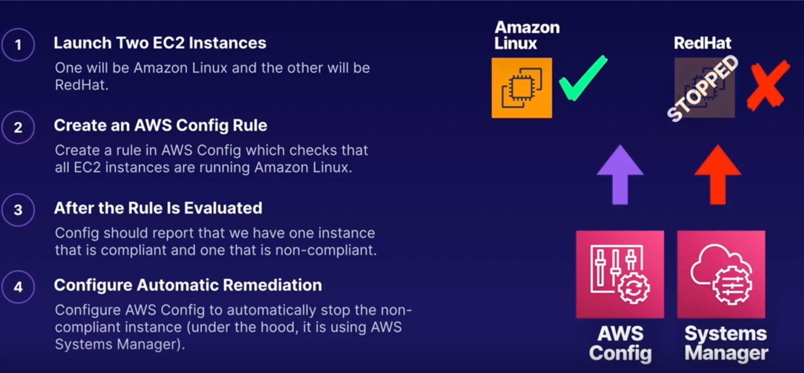
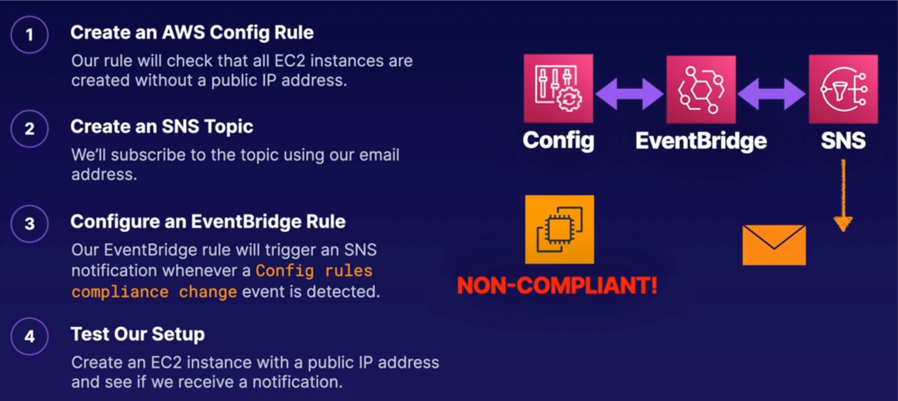

# AWS Config

- **Configuration Monitoring.** Continuously monitors the configuration of your AWS resources.
- **Desired State.** Evaluates configurations against a desired state that you define.
- **Notification.** Sends events to EventBridge and SNS if a resource deviates from the desired state, e.g. a non-compliant resource can trigger an SNS notification.
- **Automatic Remediation.** Automatically remediates non-compliant resources by triggering an action that you define.

1. Change History
    - Change history is stored in an S3 bucket.
2. Integrated
    - Integrated with loads of AWS services!
        - IAM
        - EC2
        - Elastic Block Store

        - Elastic Load Balancer
        - CloudFormation
        - CloudFront
        - Cloud Trail
        - KMS
        - RDS
        - S3
        - Security Groups
        - SNS
        - VPC

3. Compliance
    - Great for compliance and security governance.

****

## AWS Config Terminolog:

### Rule

- A Config rule represents the desired configuration for a specific resource.

### Managed Rules

- AWS provides over 180 managed rules for pre-defined common best practices (you can also create your own).

## Examples

```bash
s3-bucket-public-read-prohibited
desired-instance-type
cloud-trail-encryption-enabled
ec2-ebs-encryption-by-default
```

## EXAMPLE 01



## EXAMPLE 02

