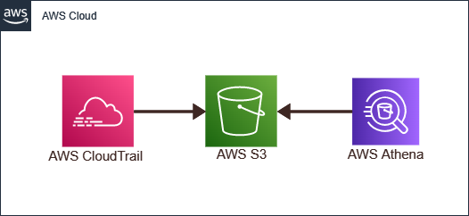

# AWS ATHENA

- Athena le permite ejecutar SQL queries de datos almacenados en S3.
- Un servicio de consulta interactivo.
- Serverless, no se aprovisiona, paga por query/por TB scanneado.
- No es necesario configurar procesos complejos de ETL (Extract/Transform/Load)
- Trabaja directamente con datos almacenados en S3.
- Casos de uso para Amazon Athena
  - Streaming analytics
  - Ad-hoc analytics on big data
  - Redshift cost reduction

Video -> <https://youtu.be/3Uzoiiu3OLo>
