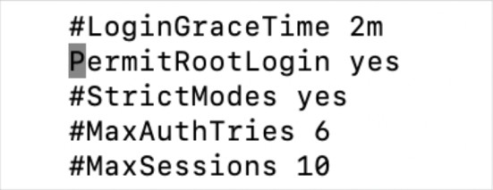
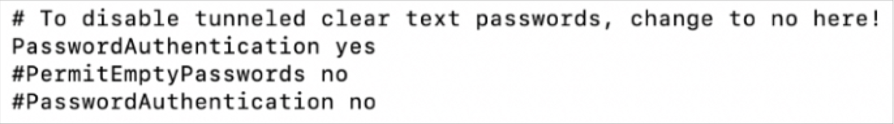

# How to login without key-pair in EC2 instance

1. Logear al Server

```console
$ ssh -i meykeypair.pem ec2-user@2.0.7.7
```

2. Cambiar configuracion de SSH.

```console
# sudo su
# vi /etc/ssh/sshd_config
```

3. Uncomment the PermitRootLogin yes to enable logins through the root user.



4. Uncomment the **PasswordAuthentication yes** and comment out the **PasswordAuthentication no**.



5. Restart the service.

```console
# sudo service sshd restart
# systemctl restart ssdh.service
```

4. Change the password of the root user.

```console
# sudo passwd root
```

## OPCIONAL | ADD USER

```console
# useradd -d /home/jhoseph jhoseph
# passwd jhoseph
```

```console
# ssh jhoseph@2.0.7.7
```


*****

# How do I add new user accounts with SSH access to my Amazon EC2 Linux instance?

1. Crear una key ssh con un nuevo usuario e ingresar a un Linux

```console
$ ssh-keygen -t rsa -f new-keypair.pem
$ chmod 400 new-keypair.pem
$ cat new-keypair.pem
```

2. Dentro de Server Linux

```console
$ sudo adduser jhoseph
$ sudo su - jhoseph
$ mkdir .ssh
$ chmod 700 .ssh/
$ touch .ssh/authorized_keys
$ chmod 600 .ssh/authorized_keys
$ nano authorized_keys #copiar contenido de la llave pública | puede copiar del usuario centos ubicacion -> cat .ssh/authorized_keys
```

3. Logear con el nuevo usuario.

```console
$ ssh -i new-keypair.pem jhoseph@1.2.3.4
```
