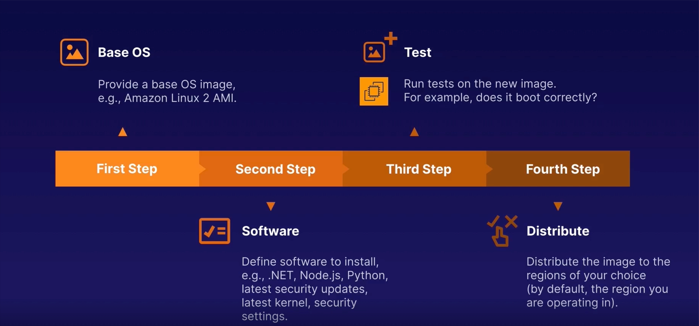
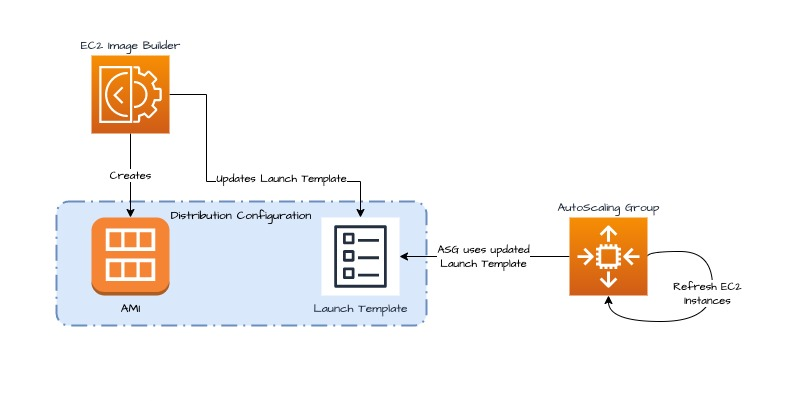

# EC2 IMAGE BUILDER

## Proceso.

1. Subir los archivos a un Bucket S3

2. Desplegar con CloudFormation.

3. Actualizar AutoScaling Group.

    - Seleccionar el AutoScalingGroup a actualizar.
    - Ir a pestaña **Instance refresh**
    - Click on boton **Start instance refresh**