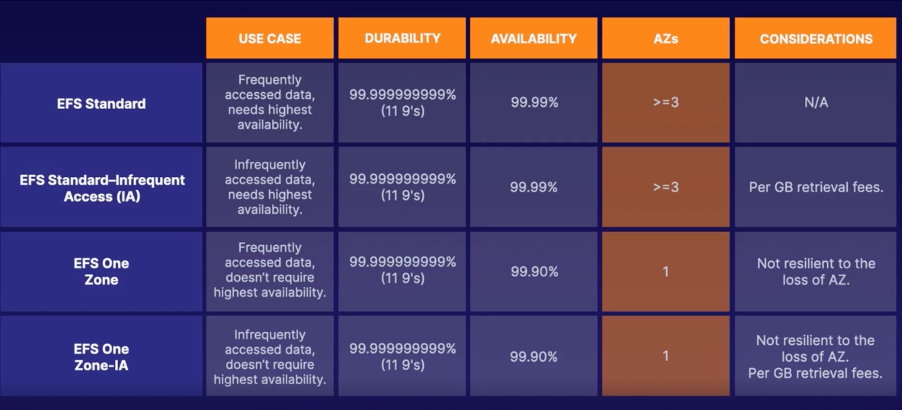

# EFS

- Soporta versión NFSv4.1.
- Se paga por almacenamiento que usas.
- Escala hasta peta bytes.

Link -> <https://docs.aws.amazon.com/es_es/efs/latest/ug/installing-amazon-efs-utils.html#installing-other-distro>

***

## EFS STORAGE CLASSES



***

## 1. MONTAR EFS A EC2 CON UBUNTU

1. Conectarse al EC2 creada.

```console
$ sudo su
# apt-get update
# apt-get -y install git binutils
# git clone https://github.com/aws/efs-utils
# cd efs-utils
# ./build-deb.sh
# apt-get -y install ./build/amazon-efs-utils*deb
# cd
# cd /mnt
# mkdir efs
# df -T
# sudo mount -t efs -o tls fs-2b808f9e:/ efs
# df -T
```

## 2. MONTAR LA EFS A LA EC2 CON AMAZON LINUX

1. Conectarse al EC2 creada.

```console
$ sudo su
# cd /mnt
# mkdir efs
# df -T
# yum install -y amazon-efs-utils
# sudo mount -t efs -o tls fs-2b808f9e:/ efs
# df -T
```

## 3. DESMONTAR EFS A EC2

```console
# cd
# sudo su
# umount efs
```
