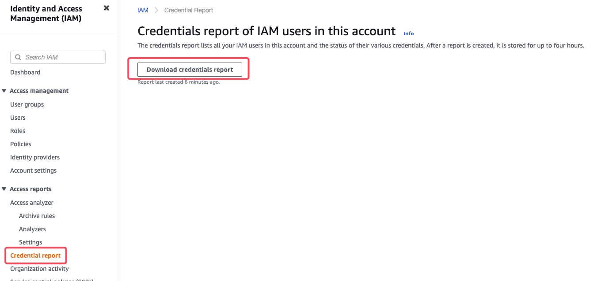

# IAM – IDENTITY AND ACCESS MANAGEMENT

- Control centralizado  de tu cuenta AWS.
- Acceso  compartido  a tu cuenta de AWS.
- Permisos específicos.
- Identidad Federada  (Incluyendo  Active Directory, Facebook,  Linkedin, etc). IDENTIDAD=ASOCIAR
- Autenticación Multi Factor.
- Provisión de acceso temporal para usuarios /  dispositivos y servicios según sea necesario.
- Permite manejar tu propia política de rotación   de contraseñas.
- Se integra con servicios de  AWS.
- Soporta PCI DSS.

***

## IAM CREDENTIAL REPORT

- You can generate and download a credential report that lists all users in your account and the status of their various credentials, including passwords, access keys, and MFA devices.

***

## IAM ACCESS ANALYZER

