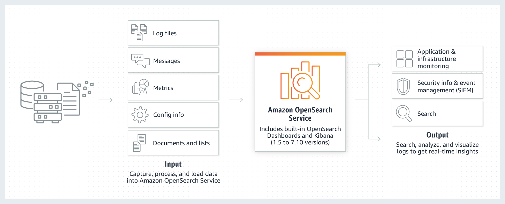

# AMAZON OPENSEARCH

- Antes conocido como Amazon ElasticSearch
- Es una tecnologia de analisis de datos de codigo abierto que permite obtener informacion en tiempo real de sus datos. (Muchas empresas usan ElasticSearch para analizar sus datos comerciales para obtener informacion y tomar mejores decisiones comerciales.)
- Ahora, cuando inicia un entorno OpenSearch en realidad consta de varias instancias EC2 diferentes que conforman lo que llaman un dominio de servicio de OpenSearch.
- Se tiene los nodos maestros que son realmente los nodos de gestión. Y también tienes los nodos de datos,
- Podemos hacer nuestro cluster publico o mantenerlo privado con nuestra VPC. En caso sea publico podemos conectarnos mediante nuestro endpoint.
- DATO: Despues que el dominio es creado, no se podra remover el endpoint publico o hacerlo privado.

Video ->  <https://youtu.be/BOTwcXSA7To>
