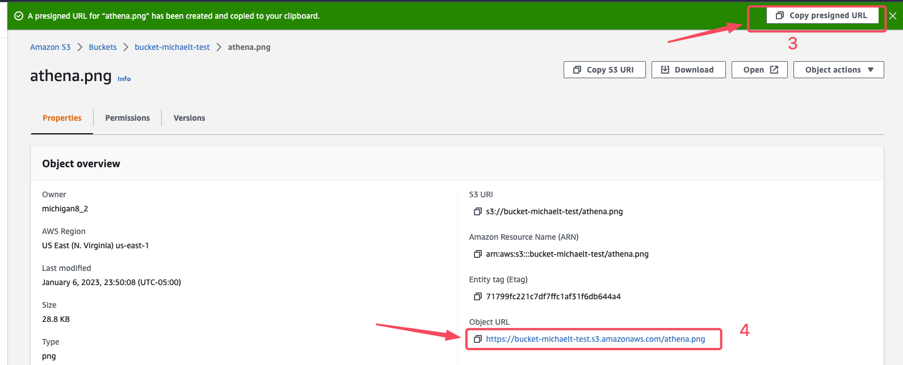

# S3

- Puede crear hasta 100 buckets en cada cuenta
- Los archivos  puede ocupar  desde  0 Bytes hasta 5 TB.
- Amazon  garantiza  una disponibilidad  del 99.99% para la plataforma S3.
- Amazon garantiza una durabilidad del 99.999999999 %  para los datos en S3 (11 x  9“s).
- Proteger datos de Accidental Deletion se usa.
  - Versioning
  - MFA - Requiere Versioning habilitado.

***

# Leveraging Presigned with S3

1. Create Bucket S3.
    - Upload a file to the bucket.

2. Create a Presigned URL.
    - Select the object and, from the **Actions** menu, select **Share with a presigned URL.**

3. Test the presigned URL.
    - Attempt to access the file using the presigned URL.

4. Try to Access Our File Anonymously.
    - We should see an **Access Denied** message.



***

# Restricting S3 Accessibility with IP Addresses.

- Se puede restringuir el acceso al bucket y solo puede acceder una ip publica o incluso el CIDR de la subnet donde trabaja el equipo de Finanzas.

```json
{
    "Version": "2012-10-17",
    "Id": "S3PolicyId1",
    "Statement": [
        {
            "Sid": "IPAllow",
            "Effect": "Allow",
            "Principal": "*",
            "Action": "s3:*",
            "Resource": "arn:aws:s3:::bucket-michaelt-test/*",
            "Condition": {
                "IpAddress": {"aws:SourceIp": "190.237.1.129/32"},
                "NotIpAddress": {"aws:SourceIp": "54.240.143.188/32"}
            }
        }
    ]
}
```

***

# S3 Inventory

## Es una herramienta que ayuda a tener el inventario de los objetos de Bucket S3, ayuda a administrar el almacenamiento, el primer reporte se obtiene despues de **48 horas**

- Pre-requisites.
  - **Bucket Source**. Bucket donde se configura S3 Inventory.
  - **Bucket Destination**. Bucket que almacena los reportes.

- El reporte es diario o semanal (Domingos).
- Metadatos que pueden ser incluidos en el reporte.
  - Object
    - Size
    - Last Modified
    - Multipart upload.
    - Replication Status
    - Encryption
    - Bucket key status
  - Storage class
    - Storage Class
    - Intelligent-Tiering
  - Data Integrity
    - ETag
    - Additional checksums function
  - Object Lock
